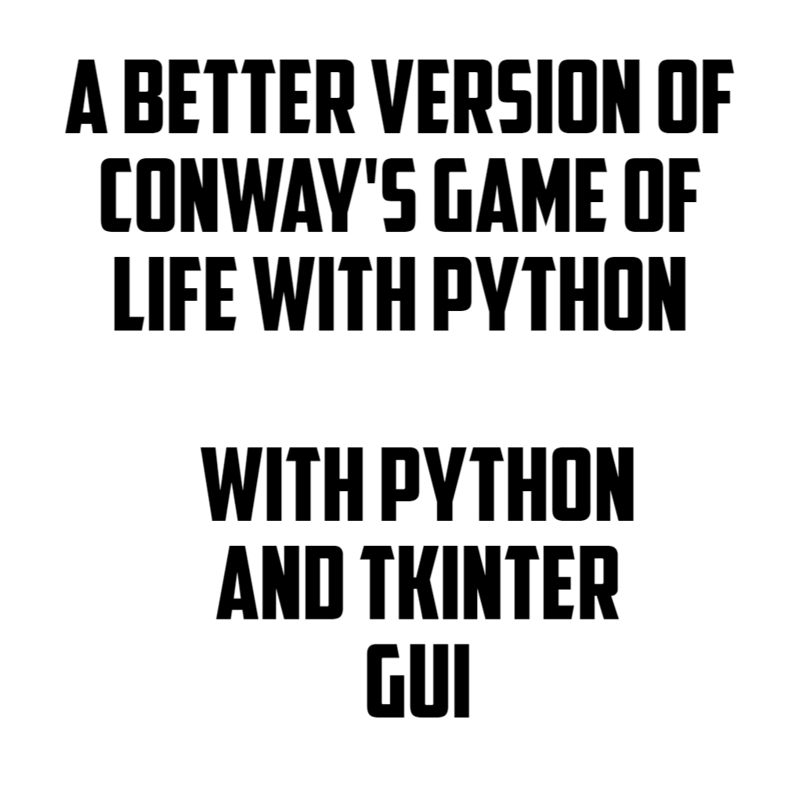

# Conway's Game of Life

  

###### Bradley Gatewood - www.btgatewood.com - December 2018

### Purpose
The purpose of this project is to develop an interactive version of Conway's Game of Life using the Python 3 language and Tkinter GUI package.  This project and all associated activities (i.e. design, development, testing, etc.) are undertaken as a personal learning exercise for the project’s creator.

### Introduction
Conway's Game of Life has four rules:
1.	If a cell is ON and has fewer than two neighbors that are ON, it turns OFF.
2.	If a cell is ON and has either two or three neighbors that are ON, it remains ON.
3.	If a cell is ON and has more than three neighbors that are ON, it turns OFF.
4.	If a cell is OFF and has exactly three neighbors that are ON, it turns ON.

Algorithm:
1.	Initialize the cells in the grid.
2.	At each time step in the simulation, for each cell (x, y) in the grid, do the following:
	a.	Update the value of cell (x, y) based on its neighbors using toroidal boundary conditions.
	b.	Update the display of grid values.

####What you have to do
1.      just clone/download this repository 
2.      confirm you have python on your machine
3.      now run this command `python game_of_life.py` and play 
